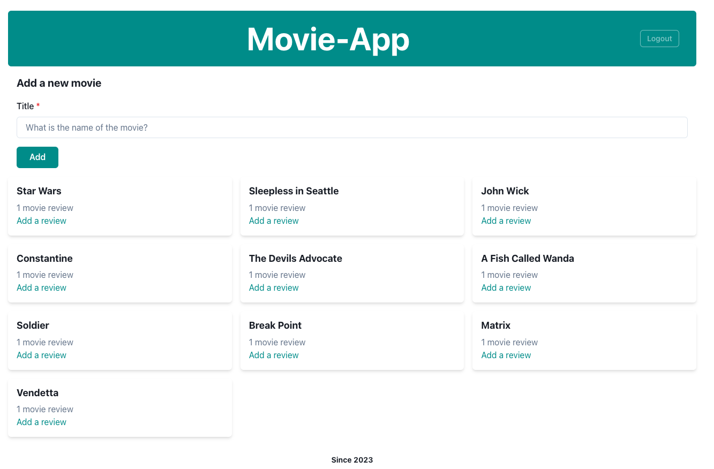
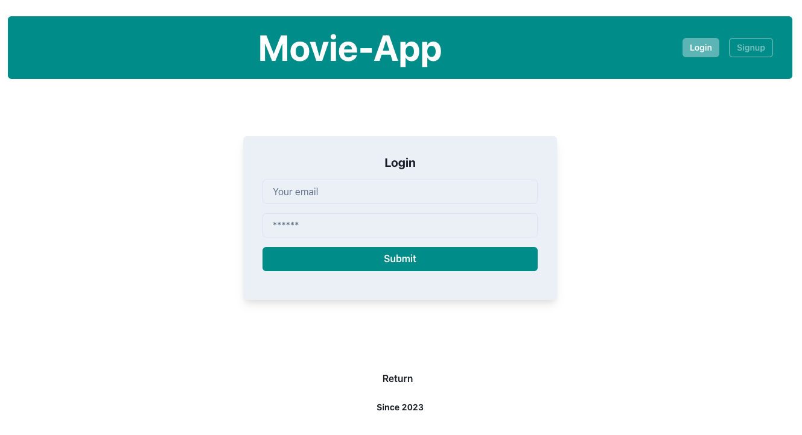

# movie-app

- The URL of the GitHub repository:

[https://github.com/jeades92/movie-app](https://github.com/jeades92/movie-app)

Heroku deployment:

[Heroku Link: movie-app-nc.herokuapp.com](https://movie-app-nc.herokuapp.com/login)

## Description

 This is an application built for the UNCC full-stack web development bootcamp by Darryl Subal, James Eades, and Michael Hobert. The Movie App lets users rate and review movies. They can also add movies to the website. The project includes storing theproject code in GitHub and utilizing it to implement feature and bug fixes using the Git branch workflow and pull requests and uploading it to Heroku.

## Technologies used

MongoDB, Mongoose, Express.js Server, React, Node.js, GraphQl, JWT Authentication, Chakra, and Heroku. 

## Screenshots

## License

The Application is covered under MIT license. Learn more about the license from the following link: [https://choosealicense.com/licenses/mit](https://choosealicense.com/licenses/mit)

## License

[]

##Questions
Contact us on Github:
- [James Eads](https://github.com/jeades92)
- [Darryl Subal](https://github.com/Dale2k)
- [Michale Hobert](https://github.com/MichaelHobert01)
